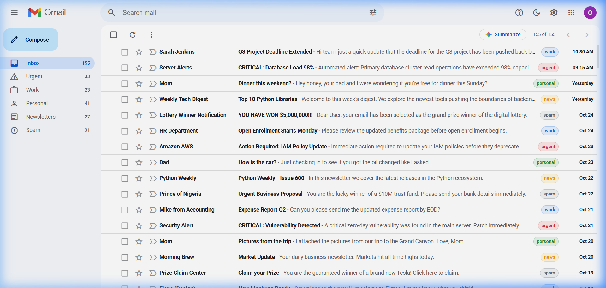
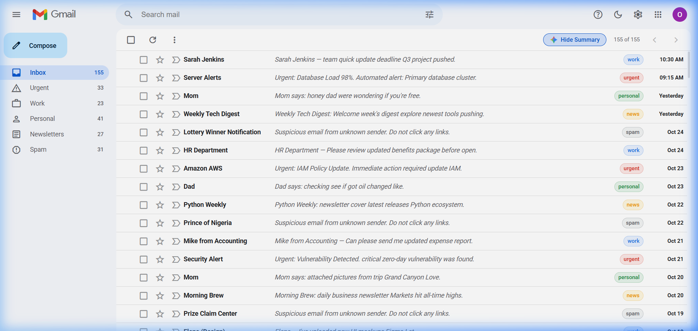
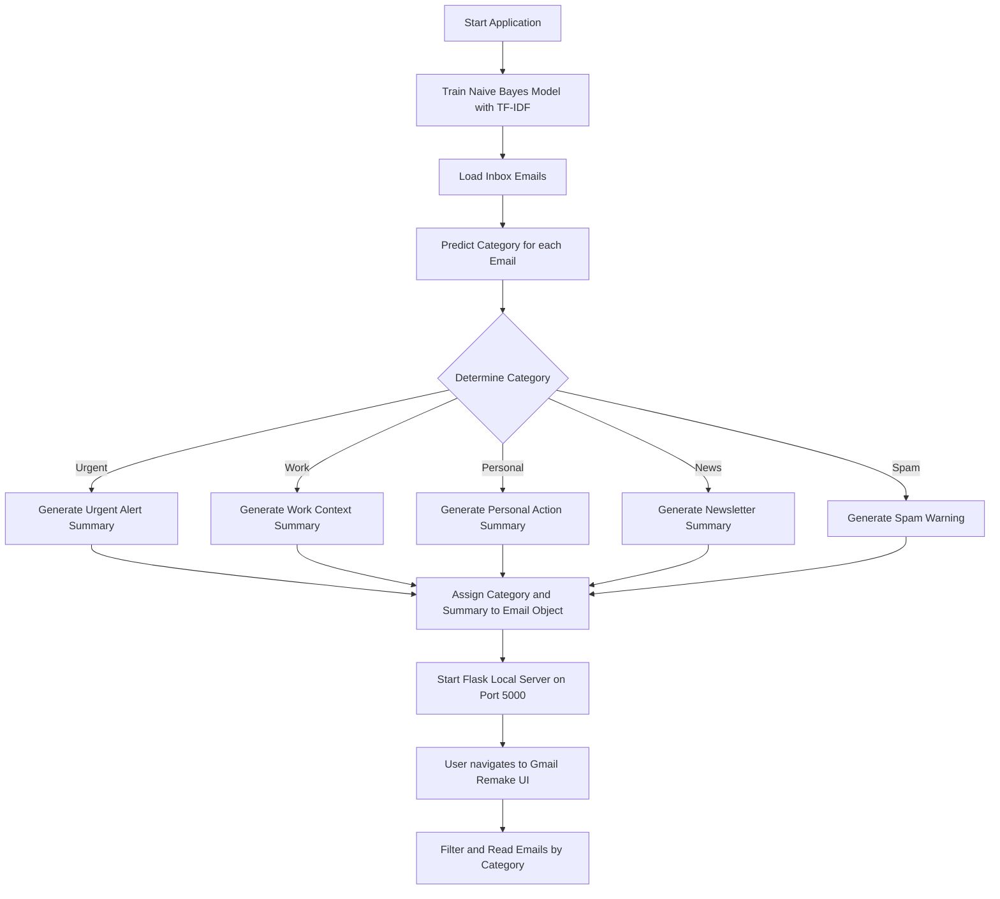

# Google Gmail Remake (AI Email Sorter)

A smart, AI-powered email inbox remake designed to look like Google Gmail. It automatically classifies incoming emails into custom categories and generates concise summaries of their contents using Machine Learning.

## 🔍 Interface Previews

### Light Mode (Default)


### AI Summaries Enabled


### Dark Mode (AI Summaries Enabled)


---

## 🚀 Key Features

*   **Intelligent Categorization:** Automatically classifies emails into five key categories: **Urgent**, **Work**, **Personal**, **News**, and **Spam**.
*   **AI-Generated Summaries:** Performs light-weight extraction to produce a clean, ~10-word summary sentence for every email in your inbox.
*   **Gmail-Inspired UI:** Sleek, responsive layout featuring custom sidebars, category filters, distinct color badges, and interactive hover states.
*   **Built-in Classifier:** Uses a Naive Bayes classifier trained on realistic email text to organize your mail offline.

---

## ⚙️ Technical Architecture & Workflow

1.  **Pipeline Training:** The application utilizes a `scikit-learn` classification pipeline combining `TfidfVectorizer` (for converting text to numerical TF-IDF features) and `MultinomialNB` (Naive Bayes classifier) to build the machine learning model.
2.  **Model Fitting:** At startup, the model fits on a pre-defined training corpus containing representative subject lines and snippets for each category.
3.  **Inference & Extraction:** Emails in the inbox are run through the trained pipeline. Depending on the predicted category, a specialized summarizer extracts key words and formats a standard summary.
4.  **Flask Web Interface:** Flask serves the dynamic dashboard, rendering filtered views of the inbox based on user selections.

### 📊 System Flowchart



---

## 🛠️ Technology Stack

*   **Backend:** Python 3, Flask
*   **Machine Learning:** scikit-learn (TF-IDF Vectorizer + Multinomial Naive Bayes)
*   **Frontend:** HTML5, Vanilla CSS3 (with dynamic transitions and Google Fonts)
*   **Tooling:** Python `venv` virtual environment

---

## 📦 Setup & Installation

Follow these steps to run the project locally:

### Prerequisites

Ensure you have **Python 3.8+** installed on your machine.

### 1. Set Up Virtual Environment

Create and activate a Python virtual environment:

```bash
# Windows
python -m venv venv
.\venv\Scripts\activate

# macOS / Linux
python3 -m venv venv
source venv/bin/activate
```

### 2. Install Dependencies

Install the required packages from `requirements.txt`:

```bash
pip install -r requirements.txt
```

### 3. Run the Server

Start the Flask application:

```bash
python app.py
```

Open your browser and navigate to `http://localhost:5000` to view the application.
